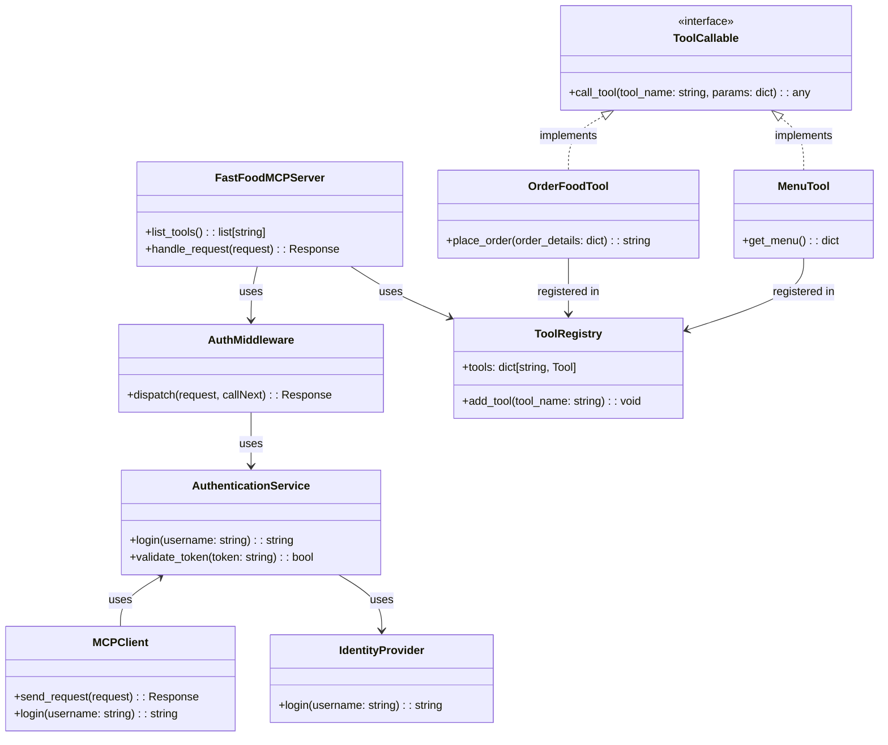

```mermaid
classDiagram

  class ToolCallable {
    <<interface>>
    +call_tool(tool_name: string, params: dict): any
  }

  class MCPClient {
    +send_request(request): Response
    +login(username: string): string
  }

  class FastFoodMCPServer {
    +list_tools(): list[string]
    +handle_request(request): Response
  }

  class AuthenticationService {
    +login(username: string): string
    +validate_token(token: string): bool
  }

  class IdentityProvider {
    +login(username: string): string
  }

  class AuthMiddleware {
    +dispatch(request, callNext): Response
  }

  class ToolRegistry {
    +tools: dict[string, Tool]
    +add_tool(tool_name: string): void
  }

  class OrderFoodTool {
    +place_order(order_details: dict): string
  }

  class MenuTool {
    +get_menu(): dict
  }

  FastFoodMCPServer --> ToolRegistry : uses
  FastFoodMCPServer --> AuthMiddleware : uses
  AuthMiddleware --> AuthenticationService : uses
  
  ToolCallable <|.. OrderFoodTool: implements
  ToolCallable <|.. MenuTool: implements

  OrderFoodTool --> ToolRegistry : registered in
  MenuTool --> ToolRegistry : registered in

  AuthenticationService <-- MCPClient : uses
  AuthenticationService --> IdentityProvider : uses
```
  